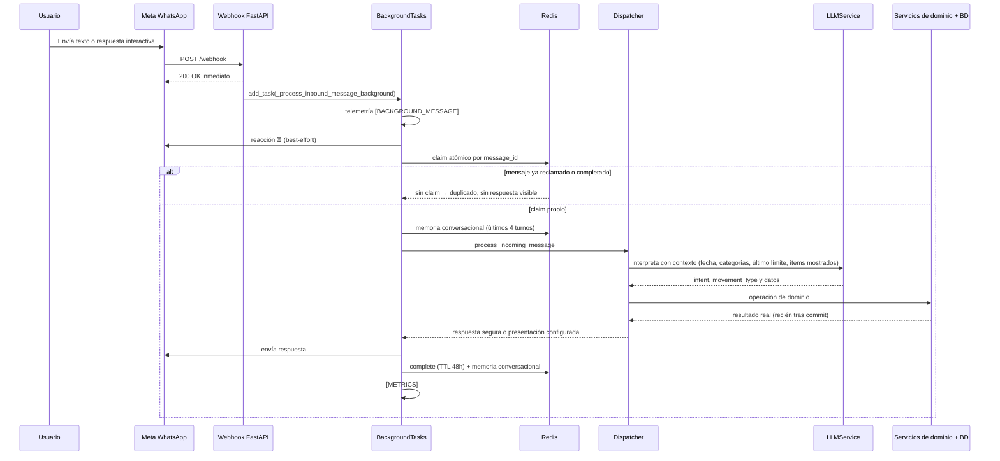

# Arquitectura

Cómo funciona el backend de Luka: componentes, flujo de un mensaje de WhatsApp y
decisiones de cada capa. El comportamiento visible para el usuario se describe en
[features.md](features.md).

## Stack

| Capa | Tecnología |
| --- | --- |
| Lenguaje | Python 3.11 |
| API | FastAPI (async) |
| Mensajería | Meta WhatsApp Business API (Graph API; versión en `WHATSAPP_GRAPH_API_VERSION`, por defecto `v26.0`) |
| LLM | Fachada `app/services/llm.py` + providers `gemini` y `mistral` en `app/services/llm_providers/`; selección por `LLM_PROVIDER`, por defecto `gemini`. El system prompt vive en `prompt.md`. |
| Base de datos | SQLAlchemy; SQLite local (`sqlite:///./luka.db`) y PostgreSQL/Supabase en producción |
| Estado y caché | Redis |
| Tareas programadas | APScheduler |
| Deploy | Docker + Render |
| Entorno de pruebas manuales | Streamlit en `testing/`, solo con Docker/Podman |

## Componentes y responsabilidades

- `app/main.py`: app FastAPI. Expone `GET /webhook` (verificación con `WHATSAPP_VERIFY_TOKEN`),
  `POST /webhook` (ingesta desacoplada), endpoints administrativos
  `/admin/conversation-flows*` (protegidos por `FLOW_ADMIN_API_KEY`) y health. En el
  `lifespan` inicializa el cliente Redis global y arranca el scheduler.
- `app/services/dispatcher.py`: orquesta el mensaje entrante. Verifica onboarding y
  comandos, resuelve estados multi-turno, llama al LLM, normaliza el intent, deriva al
  servicio de dominio y construye la respuesta segura. No persiste datos financieros
  por sí mismo.
- `app/services/llm.py`: fachada de interpretación. Carga el prompt, delega en el
  provider activo y normaliza la respuesta estructurada.
- `app/services/llm_contract.py`: normalización del JSON del proveedor y resolución de
  fechas relativas.
- `app/services/finance.py`: validación, alta, consulta, edición y anulación de
  movimientos; categorías del usuario.
- `app/services/limit.py`: alta, edición, listado y eliminación de límites mensuales por
  categoría y moneda.
- `app/services/budget.py`: consumo, disponible, porcentaje y exceso derivados de los
  egresos persistidos. No guarda saldos.
- `app/services/reminder.py`: CRUD de recordatorios de pago y preferencia de
  recordatorio proactivo.
- `app/services/onboarding.py`: invitaciones de vinculación para WhatsApp desconocidos.
- `app/services/dashboard_link.py`: enlaces mágicos de acceso al dashboard para
  usuarios ya vinculados (comando `/link`).
- `app/services/conversation.py`: estado multi-turno, contexto acotado y memoria
  conversacional en Redis.
- `app/services/conversation_flow.py`, `conversation_flow_contract.py` y
  `conversation_flow_runtime.py`: flujos de presentación administrables, su validación,
  versionado, resolución y render.
- `app/services/intent_routing.py` y `app/services/reference_resolution.py`:
  correcciones deterministas de frases de alta confianza (límites, consultas,
  correcciones de movimientos) y resolución de referencias como «ese», «el segundo» o
  «ambos».
- `app/services/webhook_idempotency.py`: reclamo atómico y deduplicación de mensajes
  entrantes.
- `app/services/telemetry.py`: fases y latencia por mensaje.
- `app/api/whatsapp.py`: único cliente saliente. Normaliza teléfonos argentinos
  `549...` → `54...`, construye payloads de texto, botones y listas, y envía la
  reacción `⏳`.
- `app/models/database.py`: engine, sesiones y todos los modelos SQLAlchemy.
- `app/scheduler.py`: jobs periódicos de recordatorios y recordatorio proactivo.

## Flujo end-to-end

Puntos clave del flujo:

- `POST /webhook` responde 200 de inmediato y procesa con `BackgroundTasks`. Es
  in-process y no durable: si el worker cae después del 200, el trabajo pendiente no se
  recupera (Meta no reintenta tras el 200).
- El reclamo de idempotencia es atómico en Redis: clave derivada de SHA-256 del
  `message_id`, valor `processing:<token>` con TTL de 15 minutos. Al terminar se marca
  `completed` con TTL de 48 horas; si el procesamiento falla antes de enviar la
  respuesta, el claim se libera para permitir el reintento.
- La deduplicación financiera es independiente: `FinanceService` consulta
  `whatsapp_message_id` antes de insertar y el modelo declara un índice único parcial.
  Un reenvío de Meta no duplica la fila y no genera una segunda respuesta visible.
- La reacción `⏳` es una señal de mejor esfuerzo con timeout HTTP de 3 segundos. Su
  falla se registra y no interrumpe el procesamiento.
- El LLM interpreta, pero el backend decide: ninguna escritura se confirma con
  `reply_text`. La confirmación se construye con el resultado del servicio de dominio
  después del commit.
- Cada mensaje deja logs `[BACKGROUND_MESSAGE]` y `[METRICS]` con `message_id`, estado,
  latencia total y las fases presentes entre `reaction_ms`, `redis_ms`, `llm_ms`,
  `db_ms` y `reply_ms`. No se registran cuerpos de mensajes, teléfonos completos,
  montos ni credenciales.
- Se procesan mensajes de tipo `text` e `interactive` (`button_reply` / `list_reply`).
  Otros tipos se registran como no soportados.

## Contrato LLM

- `intent="expense"` se conserva por compatibilidad y cubre tanto ingresos como egresos.
  El tipo real lo define `movement_type`: `ingreso`, `egreso` o `null`.
- `transaction_type` se acepta como alias y se normaliza a `movement_type`. Si el
  proveedor declara un tipo explícito inválido, se normaliza a `null`; si devuelve
  `intent="expense"` sin campo de tipo, se conserva el fallback histórico a `egreso`.
- El LLM solo puede devolver intents del registro cerrado de `LLMService`. Un intent
  desconocido se convierte en `out_of_scope`.
- No se persisten como movimientos los intents `greeting`, `out_of_scope`, `reminder`,
  `budget_query`, `expense_summary`, `query_movements`, `create_reminder`,
  `list_reminders`, `update_reminder`, `pause_reminder`, `activate_reminder`,
  `delete_reminder`, `enable_proactive_reminders`, `disable_proactive_reminders`,
  `confirm_category`, `reject_category`, `delete_category`, `list_categories`,
  `create_limit`, `change_limit`, `list_limits`, `delete_limit`, `confirm_limit`,
  `reject_limit`, `update_movement`, `delete_movement`, `compensate_budget`,
  `confirm_compensation`, `reject_compensation` y `reset_context`.
- `compensate_budget` calcula una propuesta de compensación entre límites de la misma
  moneda y período, la deja pendiente y emite el evento `budget.compensation_proposed`.
  Solo se persiste al confirmar (`confirm_compensation`), previa revalidación; el
  rechazo (`reject_compensation`) no escribe. El dispatcher también puede proponerla
  automáticamente al registrar un egreso que excede un límite.
- `reset_context` ejecuta el reset en el backend: limpia la memoria conversacional del
  usuario y el estado multi-turno pendiente, y responde con un texto fijo («Listo,
  arrancamos de cero. Olvidé lo anterior.»). El LLM solo detecta el pedido explícito.
- Si el JSON no valida, `LLMService` reintenta una vez con una instrucción de formato y
  vuelve a normalizar. Ante error del proveedor devuelve `out_of_scope` con un mensaje
  seguro.
- Antes del routing final, `intent_routing` y `reference_resolution` corrigen frases
  cortas o referenciales de alta confianza (por ejemplo correcciones de importe,
  «borrá ese movimiento», listas de límites). El LLM sigue siendo el parser general; el
  backend nunca acepta IDs de registros propuestos por el modelo.

## Estado conversacional en Redis

- `ConversationService` crea su propio cliente Redis por event loop (separado del
  cliente global del webhook). El estado se cachea por corrutina/ContextVar con
  copy-on-write y se persiste con TTL. Si Redis no está disponible, loguea y devuelve
  estado vacío: la degradación es silenciosa y los flujos que dependen de contexto se
  interrumpen pidiendo una referencia explícita.
- Estados multi-turno: confirmación de categoría, datos faltantes de recordatorio,
  renombrado de recordatorio por título duplicado, confirmación de año y de categoría
  de un límite, datos faltantes de límite, selección de mes a eliminar, categoría a
  eliminar y confirmación de compensación de presupuesto
  (`awaiting_compensation_confirmation`).
- Contexto acotado por usuario: último movimiento registrado, último límite creado,
  elementos recientemente mostrados y selección pendiente. Los TTL son 30 minutos para
  el estado de conversación y el flujo administrable, y 60 minutos para último
  movimiento y último límite.
- La memoria conversacional guarda los últimos 4 turnos completos por usuario en la
  clave `conversation_memory:whatsapp:{whatsapp_id}`, con TTL de 24 horas desde la última
  actividad. El append y el recorte de la ventana se hacen de forma atómica en un solo
  `EVAL`, con deduplicación por id de mensaje. Los mensajes se sanean (enlaces y tokens)
  antes de guardarse y su contenido nunca se registra en logs. Si Redis falla, la
  memoria se trata como vacía y el webhook sigue funcionando.
- El intent `reset_context` limpia en el backend la memoria conversacional del usuario y
  el estado multi-turno pendiente.

## Scheduler

`app/scheduler.py` usa un `AsyncIOScheduler` que arranca en el `lifespan` de la app.
Corre dos jobs cada 5 minutos y está pensado para un único worker (el `Dockerfile`
usa `gunicorn -w 1`).

- `check_reminders`: envía el aviso de cada recordatorio activo el día anterior al
  vencimiento, una vez por mes (`ultimo_aviso_enviado`). Si la ventana de 24 horas de
  WhatsApp está abierta manda texto libre; si está cerrada usa el template configurado
  en `WHATSAPP_REMINDER_TEMPLATE_NAME` y omite el envío si no hay template.
- `check_proactive_prompts`: solo dentro de la hora local
  `PROACTIVE_PROMPT_HOUR` (America/Argentina/Buenos_Aires) y para usuarios con
  `proactivo_habilitado`, `whatsapp_id`, ventana de 24h abierta y sin movimientos
  vigentes de hoy. `proactivo_ultimo_envio` se reclama antes de enviar para garantizar
  como máximo un aviso diario y se libera si el envío falla.

## Acceso a datos

- El backend es el único mediador. WhatsApp → backend → Supabase y dashboard →
  backend → Supabase; el frontend no consulta tablas financieras directamente.
- `public.movimientos_financieros` tiene RLS habilitado sin policies públicas para
  `anon` ni `authenticated`; la autorización se centraliza en el backend.
- El engine SQLAlchemy es síncrono (`pool_pre_ping`) y el dispatcher deriva a
  `asyncio.to_thread` las operaciones de dominio para no bloquear el event loop.
- El esquema se versiona en `supabase/migrations/` (forward-only). Los modelos
  SQLAlchemy y el historial local no demuestran por sí solos el estado aplicado en
  Supabase; ver [database.md](database.md).

## Limitaciones actuales

- Las métricas viven solo en logs: no hay almacenamiento histórico, dashboard ni
  alertas automáticas de latencia o errores.
- `BackgroundTasks` no es durable. Una cola durable u outbox queda pendiente para
  garantizar entrega.
- La latencia no se mide formalmente por etapa; solo se registran las fases en logs.
- No hay rate limiting ni protección frente al abuso de tokens.
- El LLM se llama antes de la deduplicación financiera por `whatsapp_message_id` y de
  la revalidación de usuario que hace `FinanceService` al persistir.
- Redis es opcional en local pero obligatorio para los flujos multi-turno; su caída
  degrada en silencio, la memoria conversacional se trata como vacía sin bloquear el
  webhook y las referencias ambiguas no se pueden resolver.
- El reclamo del recordatorio proactivo ocurre antes del envío: un crash entre ambos
  pierde el aviso de ese día.
- Queda verificar en Supabase los índices productivos, incluido el índice único parcial
  de `whatsapp_message_id`, y el estado aplicado de cada migración.

## Documentación relacionada

- [features.md](features.md): funcionalidades vigentes y su comportamiento.
- [database.md](database.md): contrato de datos, modelos y migraciones.
- [development.md](development.md): setup local, tests, variables de entorno y deploy.
- [conversation-flows.md](conversation-flows.md): flujos de presentación administrables.
