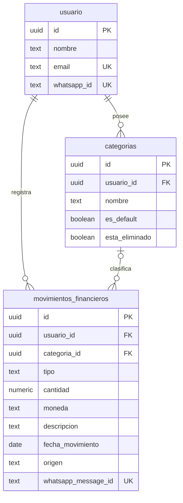

# Base de datos

Estado del contrato de datos de LUKA después de preparar STK-143 y relación entre el código, las migraciones y Supabase.

## Fuentes de verdad y alcance

El repositorio contiene fuentes con propósitos distintos:

| Fuente | Qué representa | Qué no demuestra |
| --- | --- | --- |
| `docs/decisions/0001-mvp-db-contract.md` | Decisión vigente sobre tablas oficiales y acceso mediado por backend. | Que el contrato ya esté aplicado en cada entorno. |
| `app/models/database.py` | Modelos SQLAlchemy que usa el backend actual. | El estado exacto de una base remota. |
| `database/migrations/` | Cambios de esquema versionados esperados por el contrato. | Que las migraciones se hayan ejecutado en Supabase. |
| `database/reference/schema_supabase_inicial_legacy.sql` | Snapshot histórico inicial, conservado solo como referencia. | El estado actual o un script apto para reconstruir o reparar la base. |
| Supabase remoto | Estado aplicado de producción o del entorno compartido. | No puede inferirse únicamente desde GitHub; requiere verificación operativa autorizada. |

`blob1618/luka` es propietario del contrato y de las migraciones. `blob1618/luka_frontend` consume el mismo esquema mediante su propio backend, pero no lo administra. Las migraciones versionadas de `database/migrations/` definen los cambios esperados; Supabase remoto representa lo realmente aplicado.

`database/reference/schema_supabase_inicial_legacy.sql` es histórico y no ejecutable. No debe usarse para reconstruir ni reparar la base. Después de aplicar y verificar una migración en Supabase se deberá generar un snapshot nuevo mediante un procedimiento controlado; STK-143 no genera todavía ese snapshot.

## Contrato DB MVP vigente

Tablas oficiales de Release 1:

- `public.usuario`
- `public.categorias`
- `public.movimientos_financieros`
- `public.limite_categoria`
- `public.recordatorio`
- `public.evento`
- `public.acuerdo_version`
- `public.acuerdo_aceptado`
- `public.onboarding_invitacion`

`public.usuario.id` continúa siendo el identificador interno y financiero. `public.usuario.whatsapp_id` identifica al remitente de WhatsApp y `public.usuario.auth_user_id` referencia la identidad en `auth.users`. Ambos identificadores externos son únicos cuando no son nulos. Los usuarios existentes permanecen con `auth_user_id = NULL`: no se vinculan ni fusionan automáticamente, y el email no se usa como criterio automático de vinculación.

`public.onboarding_invitacion` conserva el WhatsApp destinatario, estado, vencimiento, contadores y eventual usuario asociado. Solo puede haber una invitación `pendiente` por WhatsApp. La matriz de estado exige: `pendiente` y `vencida` sin usuario ni fechas terminales; `consumida` con usuario y `consumida_en`, pero sin `revocada_en`; y `revocada` solo con `revocada_en`. La FK al usuario usa `ON DELETE RESTRICT` para preservar la trazabilidad de invitaciones consumidas. El token original nunca se persiste: la tabla almacena únicamente `token_hash`, que es único y no vacío.

`public.acuerdo_version` identifica versiones únicas y permite una sola versión vigente. `vigente_desde` es nullable y solo resulta obligatorio cuando `esta_vigente=true`, evitando fabricar fechas para versiones históricas inactivas. `public.acuerdo_aceptado` registra una aceptación por usuario y versión: las filas históricas se rotulan `legacy_desconocido` cuando su procedencia no puede demostrarse y las nuevas aceptaciones usan `web_onboarding` por defecto. No se insertaron versiones ni aceptaciones; todavía falta incorporar el contenido legal aprobado.

La FK PostgreSQL `public.usuario.auth_user_id -> auth.users(id)` existe únicamente en la migración. El metadata SQLAlchemy omite esa FK deliberadamente porque `auth.users` no existe en SQLite; la columna y su unicidad parcial sí se representan en ambos contratos.

`public.movimientos_financieros` es la entidad central para ingresos y egresos.


## Modelos actuales del backend

`app/models/database.py` define actualmente:

- `Usuario` -> `usuario`
- `OnboardingInvitacion` -> `onboarding_invitacion`
- `AcuerdoVersion` -> `acuerdo_version`
- `AcuerdoAceptado` -> `acuerdo_aceptado`
- `Categoria` -> `categorias`
- `LimiteCategoria` -> `limite_categoria`
- `Recordatorio` -> `recordatorio`
- `Evento` -> `evento`
- `MovimientoFinanciero` -> `movimientos_financieros`

Diagrama de las entidades que participan directamente en STK-35:



Este diagrama representa el contrato del ORM, no una verificación del esquema remoto.

## Persistencia de movimientos de STK-35

El flujo oficial es:

```text
WhatsApp -> Backend -> public.movimientos_financieros
```

`FinanceService.register_movement_from_whatsapp_text()` aplica estas reglas:

- Requiere `sender_phone` y busca una coincidencia en `public.usuario.whatsapp_id`.
- No crea usuarios. Sin usuario vinculado devuelve `user_not_found` y no guarda el movimiento.
- Admite `tipo` `ingreso` o `egreso`, monto positivo, moneda y descripción.
- Usa `ARS` cuando el resultado del LLM no incluye moneda y normaliza el valor a mayúsculas.
- Busca una categoría activa perteneciente al usuario.
- No crea categorías automáticamente. Sin coincidencia guarda `categoria_id=null`.
- Guarda `origen="whatsapp_text"` y el identificador de Meta en `whatsapp_message_id`.
- Confirma al usuario solo después de un commit exitoso.

El alta, register, login y vinculación inicial de usuarios no forman parte de STK-35. Las categorías default o personalizadas también requieren trabajo separado.

## Deduplicación e índices

El backend consulta `whatsapp_message_id` antes de insertar. Si ya existe, devuelve `duplicate` y evita una segunda fila. Cuando Meta reenvía el mismo evento, el webhook puede enviar una segunda respuesta visible indicando el duplicado; este comportamiento sigue pendiente de corrección.

La migración versionada `database/migrations/001_mvp_movimientos_financieros.sql` y el ORM declaran un índice único parcial sobre `movimientos_financieros.whatsapp_message_id`. La migración también declara índices para búsqueda de usuario y consultas de movimientos.

Esto define el contrato esperado, pero no prueba el estado productivo. Queda pendiente verificar en Supabase:

- El índice de `public.usuario.whatsapp_id`.
- El índice único parcial real de `public.movimientos_financieros.whatsapp_message_id`.
- Los índices por usuario, fecha, tipo y categoría necesarios para consultas productivas.
- Cualquier índice adicional requerido para resolver categorías activas del usuario.

Hasta esa verificación, la deduplicación de aplicación reduce duplicados secuenciales, pero la protección robusta ante concurrencia depende del índice único aplicado en la base.

## Migraciones y desarrollo local

Sí existen migraciones SQL versionadas en GitHub dentro de `database/migrations/`. STK-143 agrega `003_onboarding_identity_consent.sql` y su rollback controlado. La migración 003 todavía no se considera aplicada: debe revisarse contra el estado y los roles reales de Supabase antes de ejecutarla.

Todavía no hay una herramienta formal como Alembic o Supabase CLI configurada como flujo único de aplicación. Por lo tanto:

1. Todo cambio de esquema debe versionarse en el repositorio antes de aplicarse.
2. La aplicación en un entorno compartido debe coordinarse mediante el proceso operativo del equipo.
3. Después de aplicar y verificar cambios remotos, debe generarse un snapshot nuevo mediante un procedimiento controlado.
4. La creación desde `Base.metadata.create_all()` queda limitada a SQLite o bases locales descartables; no sustituye migraciones en Supabase.

Configuración local por defecto:

```text
sqlite:///./luka.db
```

Producción y entornos compartidos usan PostgreSQL mediante `DATABASE_URL`, normalmente en Supabase.

## Acceso a datos financieros y RLS

Para Release 1, el acceso financiero es mediado por backend:

- WhatsApp -> Backend -> Supabase/PostgreSQL.
- Dashboard -> Backend -> Supabase/PostgreSQL.

No se permite que un dashboard consulte directamente los movimientos financieros de Supabase en esta etapa. El backend debe aplicar autorización y filtrar siempre por el usuario correspondiente.

Las migraciones declaran `ENABLE ROW LEVEL SECURITY` para las tablas alcanzadas. La migración 003 lo habilita en `usuario`, `onboarding_invitacion`, `acuerdo_version` y `acuerdo_aceptado`, sin policies ni `GRANT` para `anon` o `authenticated`. El estado efectivo y la compatibilidad de los roles de conexión backend deben verificarse en Supabase antes de aplicarla.

El rollback de la migración 003 no ejecuta `DISABLE ROW LEVEL SECURITY` sobre tablas preexistentes: deja RLS habilitado porque no puede conocer de forma segura el estado anterior y deshabilitarlo podría reducir protecciones existentes.

El micrositio/dashboard y su acceso seguro mediante Magic Link están relacionados con STK-54. Requieren coordinación entre backend y frontend y no fueron implementados por STK-35.

## Funcionalidad fuera de STK-35

- Consulta de movimientos de STK-128.
- Alta y vinculación oficial de usuarios por WhatsApp.
- Login y Magic Link.
- Generación, hashing, envío, consumo y revocación funcional de invitaciones.
- Contenido legal aprobado y flujo de aceptación.
- Categorías default y administración de categorías personalizadas.
- Validación de consentimiento y escritura de eventos dentro del flujo de movimientos.
- Endpoints financieros del dashboard.

Estas capacidades pueden formar parte de la arquitectura objetivo, pero no deben documentarse como comportamiento actual de STK-35.

## Pendientes operativos y de seguridad/costos

- Reexportar el schema después de confirmar el estado real de Supabase.
- Verificar índices productivos y el índice único parcial de deduplicación.
- Agregar observabilidad de latencia para webhook, LLM, base y respuesta. Durante pruebas manuales se observó una latencia aproximada de 5–10 segundos en el flujo completo, pendiente de medición formal por etapa.
- Investigar typing indicator y mark as read en WhatsApp Business API.
- Incorporar rate limiting y protecciones frente a abuso de tokens.
- Evitar llamar al LLM para usuarios no registrados o mensajes ya procesados.
- Evaluar un pre-router para saludos y solicitudes claramente fuera de alcance.
- Definir una herramienta y procedimiento formal de migraciones.
