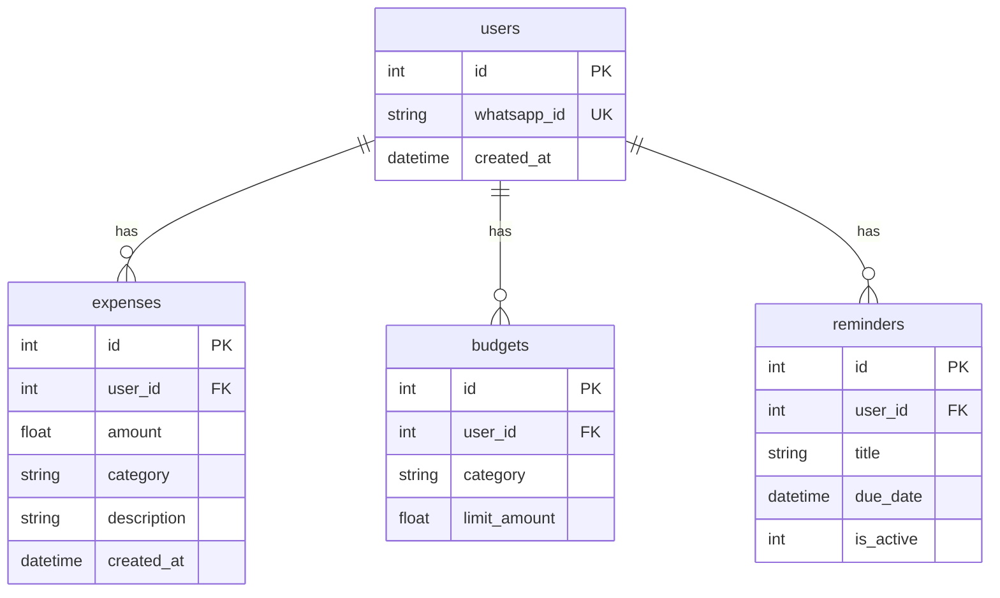

# Database

Documento minimo para ubicar la base de datos actual y el diseno objetivo de LUKA.

## Fuentes usadas

- Codigo actual: `app/models/database.py`.
- Guia existente: `SUPABASE_SETUP.md`.
- PDF de referencia: `Flujo de datos y Script DB.pdf`.

## Estado actual en el repo

El codigo actual usa SQLAlchemy y toma la conexion desde `DATABASE_URL`.

- Local por defecto: `sqlite:///./luka.db`.
- Produccion/entornos compartidos: PostgreSQL en Supabase.
- Modelos actuales: `User`, `Expense`, `Budget`, `Reminder`.

Tablas actuales segun `app/models/database.py`:

- `users`
- `expenses`
- `budgets`
- `reminders`

Comando actual para crear tablas desde los modelos:

```powershell
python -c "from app.models.database import engine, Base; Base.metadata.create_all(bind=engine)"
```

No hay scripts SQL, dumps de schema, carpeta `supabase/` ni migraciones versionadas en GitHub.

## Diseno objetivo del MVP

El PDF `Flujo de datos y Script DB.pdf` propone un modelo PostgreSQL/Supabase mas completo, con eventos auditables y estado proyectado.

Tablas propuestas:

- `usuarios`
- `versiones_consentimiento`
- `consentimientos_usuario`
- `categorias`
- `limites_gasto`
- `recordatorios`
- `eventos`

Enums propuestos:

- `estado_usuario_enum`
- `tipo_evento_enum`

Tambien propone indices, triggers y funciones para registrar eventos y actualizar timestamps.

## Regla de arquitectura de datos

El modelo objetivo separa:

- Eventos: historico auditable e inmutable.
- Proyecciones: estado actual optimizado para consultas.

Regla operativa:

1. Recibir request.
2. Validar reglas de negocio.
3. Generar evento.
4. Persistir evento.
5. Actualizar proyeccion.

No se deberia escribir estado proyectado sin generar el evento correspondiente.

## Release 1

Mientras no exista un script SQL o migracion versionada, la unica fuente verificable en GitHub para Release 1 es `app/models/database.py`.

Eso significa que el esquema valido hoy para desarrollo es:

- `users`
- `expenses`
- `budgets`
- `reminders`

El diseno de eventos/consentimiento del PDF debe tratarse como objetivo pendiente hasta que se implemente en codigo o en SQL versionado.

Release 1 objetivo deberia usar la base para:

- Identificar usuarios registrados.
- Bloquear interacciones de usuarios no registrados.
- Validar consentimiento vigente antes de guardar datos financieros.
- Registrar eventos relevantes.
- Guardar estado actual en tablas proyectadas.
- Soportar categorias, limites y recordatorios si entran en alcance.

## Diferencia importante

Hay una brecha entre el codigo actual y el diseno del PDF:

- El codigo actual usa tablas simples en ingles: `users`, `expenses`, `budgets`, `reminders`.
- El diseno objetivo usa tablas en espanol, UUIDs, consentimiento versionado, categorias, limites y eventos.

Antes de desarrollar tickets que toquen persistencia, el equipo tiene que decidir si adapta el codigo al script del PDF o si ajusta el script al modelo actual.

## Diagrama actual

Diagrama Mermaid basado en `app/models/database.py`:



Para un equipo chico, esta es la opcion mas simple y mantenible por ahora. Si Supabase pasa a ser la fuente real del esquema, conviene exportar el schema SQL y regenerar el diagrama desde ese schema.

## Versionado recomendado

Opcion minima recomendada:

1. Exportar el schema real de Supabase/PostgreSQL.
2. Guardarlo en GitHub como `database/schema.sql`.
3. Actualizar `docs/database.md` cada vez que cambie el schema.

Cuando el equipo necesite historial de cambios, pasar a migraciones:

```text
supabase/migrations/<timestamp>_<descripcion>.sql
```

No puedo confirmar si hay cambios hechos directamente en Supabase porque no hay acceso real a ese proyecto desde el repo. Si existen, hoy no estan representados en GitHub.

## Pendiente de validar

- Versionar el script SQL real dentro del repo.
- Confirmar proyecto/URL final de Supabase.
- Definir si se agregan migraciones, por ejemplo Alembic.
- Definir RLS/politicas de acceso en Supabase.
- Confirmar si `recordatorios` entra en Release 1 o queda preparado para despues.
- Confirmar como se va a garantizar que toda mutacion genere evento.
- Definir si Redis se usa para rate limiting, deduplicacion o cache de usuario.
