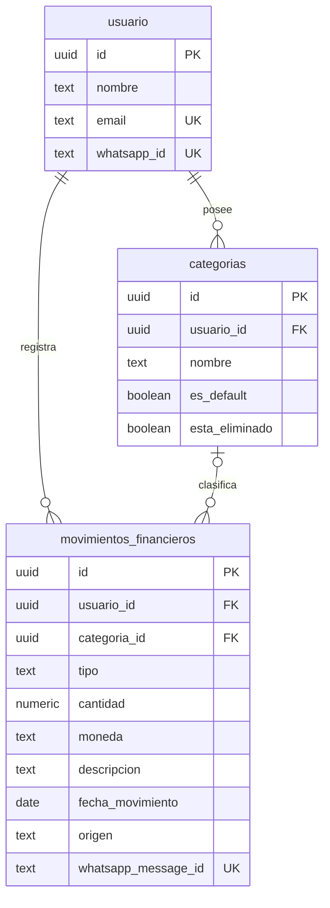

# Base de datos

Estado del contrato de datos de LUKA después de STK-35 y relación entre el código, las migraciones y Supabase.

## Fuentes de verdad y alcance

El repositorio contiene fuentes con propósitos distintos:

| Fuente | Qué representa | Qué no demuestra |
| --- | --- | --- |
| `docs/decisions/0001-mvp-db-contract.md` | Decisión vigente sobre tablas oficiales y acceso mediado por backend. | Que el contrato ya esté aplicado en cada entorno. |
| `app/models/database.py` | Modelos SQLAlchemy que usa el backend actual. | El estado exacto de una base remota. |
| `database/migrations/` | Cambios de esquema versionados esperados por el contrato. | Que las migraciones se hayan ejecutado en Supabase. |
| `database/schema_supabase_actual.sql` | Último snapshot local exportado como referencia. | Que siga actualizado después de migraciones o cambios remotos. |
| Supabase remoto | Estado aplicado de producción o del entorno compartido. | No puede inferirse únicamente desde GitHub; requiere verificación operativa autorizada. |

`database/schema_supabase_actual.sql` actualmente no contiene todas las incorporaciones de STK-35. Debe tratarse como un snapshot potencialmente desactualizado hasta que el equipo reexporte el esquema real. No es una migración y no debe ejecutarse como tal.

## Contrato DB MVP vigente

Tablas oficiales de Release 1:

- `public.usuario`
- `public.categorias`
- `public.movimientos_financieros`
- `public.limite_categoria`
- `public.recordatorio`
- `public.evento`
- `public.acuerdo_version`
- `public.acuerdo_aceptado`

`public.usuario` es la tabla oficial de usuarios. El identificador recibido desde WhatsApp se vincula con el usuario interno mediante `public.usuario.whatsapp_id`.

`public.movimientos_financieros` es la entidad central para ingresos y egresos. Las nuevas features no deben escribir en `public.gastos` ni depender de otras tablas legacy.

Tablas legacy/no usadas para features nuevas:

- `public.usuarios`
- `public.presupuestos`
- `public.recordatorios`
- `public.limites_gasto`
- `public.versiones_consentimiento`
- `public.consentimientos_usuario`
- `public.gastos`

Las tablas legacy no se eliminan como parte de STK-35.

## Modelos actuales del backend

`app/models/database.py` define actualmente:

- `Usuario` -> `usuario`
- `AcuerdoVersion` -> `acuerdo_version`
- `AcuerdoAceptado` -> `acuerdo_aceptado`
- `Categoria` -> `categorias`
- `LimiteCategoria` -> `limite_categoria`
- `Recordatorio` -> `recordatorio`
- `Evento` -> `evento`
- `MovimientoFinanciero` -> `movimientos_financieros`

Diagrama de las entidades que participan directamente en STK-35:



Este diagrama representa el contrato del ORM, no una verificación del esquema remoto.

## Persistencia de movimientos de STK-35

El flujo oficial es:

```text
WhatsApp -> Backend -> public.movimientos_financieros
```

`FinanceService.register_movement_from_whatsapp_text()` aplica estas reglas:

- Requiere `sender_phone` y busca una coincidencia en `public.usuario.whatsapp_id`.
- No crea usuarios. Sin usuario vinculado devuelve `user_not_found` y no guarda el movimiento.
- Admite `tipo` `ingreso` o `egreso`, monto positivo, moneda y descripción.
- Usa `ARS` cuando el resultado del LLM no incluye moneda y normaliza el valor a mayúsculas.
- Busca una categoría activa perteneciente al usuario.
- No crea categorías automáticamente. Sin coincidencia guarda `categoria_id=null`.
- Guarda `origen="whatsapp_text"` y el identificador de Meta en `whatsapp_message_id`.
- Confirma al usuario solo después de un commit exitoso.

El alta, register, login y vinculación inicial de usuarios no forman parte de STK-35. Las categorías default o personalizadas también requieren trabajo separado.

## Deduplicación e índices

El backend consulta `whatsapp_message_id` antes de insertar. Si ya existe, devuelve `duplicate` y evita una segunda fila. Cuando Meta reenvía el mismo evento, el webhook puede enviar una segunda respuesta visible indicando el duplicado; este comportamiento sigue pendiente de corrección.

La migración versionada `database/migrations/001_mvp_movimientos_financieros.sql` y el ORM declaran un índice único parcial sobre `movimientos_financieros.whatsapp_message_id`. La migración también declara índices para búsqueda de usuario y consultas de movimientos.

Esto define el contrato esperado, pero no prueba el estado productivo. Queda pendiente verificar en Supabase:

- El índice de `public.usuario.whatsapp_id`.
- El índice único parcial real de `public.movimientos_financieros.whatsapp_message_id`.
- Los índices por usuario, fecha, tipo y categoría necesarios para consultas productivas.
- Cualquier índice adicional requerido para resolver categorías activas del usuario.

Hasta esa verificación, la deduplicación de aplicación reduce duplicados secuenciales, pero la protección robusta ante concurrencia depende del índice único aplicado en la base.

## Migraciones y desarrollo local

Sí existen migraciones SQL versionadas en GitHub dentro de `database/migrations/`. La primera migración del contrato de movimientos es `001_mvp_movimientos_financieros.sql`.

Todavía no hay una herramienta formal como Alembic o Supabase CLI configurada como flujo único de aplicación. Por lo tanto:

1. Todo cambio de esquema debe versionarse en el repositorio antes de aplicarse.
2. La aplicación en un entorno compartido debe coordinarse mediante el proceso operativo del equipo.
3. Después de aplicar cambios remotos, debe reexportarse `database/schema_supabase_actual.sql`.
4. La creación desde `Base.metadata.create_all()` queda limitada a SQLite o bases locales descartables; no sustituye migraciones en Supabase.

Configuración local por defecto:

```text
sqlite:///./luka.db
```

Producción y entornos compartidos usan PostgreSQL mediante `DATABASE_URL`, normalmente en Supabase.

## Acceso a datos financieros y RLS

Para Release 1, el acceso financiero es mediado por backend:

- WhatsApp -> Backend -> Supabase/PostgreSQL.
- Dashboard -> Backend -> Supabase/PostgreSQL.

No se permite que un dashboard consulte directamente los movimientos financieros de Supabase en esta etapa. El backend debe aplicar autorización y filtrar siempre por el usuario correspondiente.

La migración declara `ENABLE ROW LEVEL SECURITY` para `public.movimientos_financieros`, pero el estado efectivo en Supabase debe verificarse en el entorno remoto. Esto no implica que existan policies públicas para `anon` o `authenticated`; la estrategia no depende de acceso directo desde frontend.

El micrositio/dashboard y su acceso seguro mediante Magic Link están relacionados con STK-54. Requieren coordinación entre backend y frontend y no fueron implementados por STK-35.

## Funcionalidad fuera de STK-35

- Consulta de movimientos de STK-128.
- Alta y vinculación oficial de usuarios por WhatsApp.
- Login y Magic Link.
- Categorías default y administración de categorías personalizadas.
- Validación de consentimiento y escritura de eventos dentro del flujo de movimientos.
- Endpoints financieros del dashboard.

Estas capacidades pueden formar parte de la arquitectura objetivo, pero no deben documentarse como comportamiento actual de STK-35.

## Pendientes operativos y de seguridad/costos

- Reexportar el schema después de confirmar el estado real de Supabase.
- Verificar índices productivos y el índice único parcial de deduplicación.
- Agregar observabilidad de latencia para webhook, LLM, base y respuesta. Durante pruebas manuales se observó una latencia aproximada de 5–10 segundos en el flujo completo, pendiente de medición formal por etapa.
- Investigar typing indicator y mark as read en WhatsApp Business API.
- Incorporar rate limiting y protecciones frente a abuso de tokens.
- Evitar llamar al LLM para usuarios no registrados o mensajes ya procesados.
- Evaluar un pre-router para saludos y solicitudes claramente fuera de alcance.
- Definir una herramienta y procedimiento formal de migraciones.
