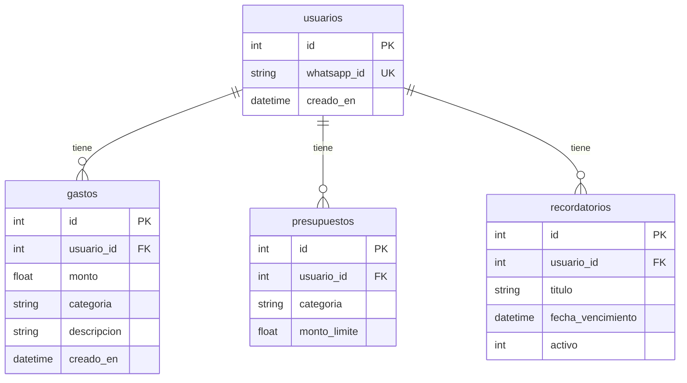

# Database

Documento minimo para ubicar la base de datos actual y el diseno objetivo de LUKA.

## Fuentes usadas

- Codigo actual: `app/models/database.py`.
- Guia existente: `SUPABASE_SETUP.md`.
- PDF de referencia: `Flujo de datos y Script DB.pdf`.
- Schema actual exportado de Supabase: `database/schema_supabase_actual.sql`.
- ADR vigente: `docs/decisions/0001-mvp-db-contract.md`.

## Contrato DB MVP vigente

Supabase actual contiene tablas mezcladas de distintos modelos. El contrato oficial para Release 1 queda definido en `docs/decisions/0001-mvp-db-contract.md`.

Tablas oficiales del contrato MVP:

- `public.usuario`
- `public.categorias`
- `public.movimientos_financieros`
- `public.limite_categoria`
- `public.recordatorio`
- `public.evento`
- `public.acuerdo_version`
- `public.acuerdo_aceptado`

`public.movimientos_financieros` es la entidad central para ingresos y egresos del flujo nuevo. `public.usuario` debe tener `whatsapp_id` para mapear el número recibido desde WhatsApp con `usuario.id`.

Tablas legacy/no usadas para nuevas features:

- `public.usuarios`
- `public.presupuestos`
- `public.recordatorios`
- `public.limites_gasto`
- `public.versiones_consentimiento`
- `public.consentimientos_usuario`
- `public.gastos`

Las tablas legacy no se borran todavía, pero las nuevas features no deben depender de ellas. Todo cambio de schema debe versionarse en GitHub antes de considerarse parte del contrato técnico.
## Acceso a datos financieros y RLS

Para Release 1, el acceso a datos financieros será mediado por el backend.

El frontend no debe consultar Supabase directamente para leer o escribir movimientos financieros. El dashboard web debe consumir endpoints del backend, y el backend debe consultar Supabase/PostgreSQL aplicando las reglas de autorización correspondientes.

La tabla `public.movimientos_financieros` tiene Row Level Security habilitado. Actualmente no hay policies públicas definidas para permitir acceso directo desde roles como `anon` o `authenticated`.

Esta decisión es intencional para el MVP:

- Evita exponer datos financieros sensibles desde el cliente.
- Evita resolver prematuramente Supabase Auth y policies basadas en `auth.uid()`.
- Centraliza la autorización en el backend.
- Permite avanzar con STK-35 y STK-54 sin bloquear el flujo principal.

Flujo permitido para Release 1:

- WhatsApp -> Backend -> Supabase/PostgreSQL.
- Dashboard web -> Backend -> Supabase/PostgreSQL.

Flujo no permitido para Release 1:

- Dashboard web -> Supabase directo para datos financieros.

Reglas para backend:

- Buscar usuarios de WhatsApp mediante `public.usuario.whatsapp_id`.
- Filtrar siempre movimientos por `usuario_id`.
- No aceptar `usuario_id` enviado por el cliente como prueba de autorización.
- No devolver listados globales de movimientos financieros.
- Confirmar operaciones al usuario solo después de una escritura exitosa en base de datos.

Si en una release futura se decide permitir acceso directo desde frontend a Supabase, deberán definirse policies RLS explícitas y una estrategia de autenticación que vincule usuarios autenticados con `public.usuario.id`.

## Estado actual en el repo

El código actual usa SQLAlchemy y toma la conexión desde `DATABASE_URL`.

- Local por defecto: `sqlite:///./luka.db`.
- Producción/entornos compartidos: PostgreSQL en Supabase.
- Modelos actuales: `User`, `Expense`, `Budget`, `Reminder`.

Tablas actuales según `app/models/database.py`:

- `usuarios`
- `gastos`
- `presupuestos`
- `recordatorios`

Comando actual para crear tablas desde los modelos:

```powershell
python -c "from app.models.database import engine, Base; Base.metadata.create_all(bind=engine)"
```

No hay migraciones versionadas en GitHub. El schema actual copiado desde Supabase queda versionado como referencia en `database/schema_supabase_actual.sql`; no debe ejecutarse como migración.

## Diseno previo de referencia

El PDF `Flujo de datos y Script DB.pdf` propuso un modelo PostgreSQL/Supabase mas completo, con eventos auditables y estado proyectado. Ese material queda como referencia historica; el contrato vigente para Release 1 es el ADR 0001.

Tablas propuestas:

- `usuarios`
- `versiones_consentimiento`
- `consentimientos_usuario`
- `categorias`
- `limites_gasto`
- `recordatorios`
- `eventos`

Enums propuestos:

- `estado_usuario_enum`
- `tipo_evento_enum`

Tambien propone indices, triggers y funciones para registrar eventos y actualizar timestamps.

## Regla previa del PDF

El modelo del PDF separaba:

- Eventos: historico auditable e inmutable.
- Proyecciones: estado actual optimizado para consultas.

Regla operativa propuesta por el PDF:

1. Recibir request.
2. Validar reglas de negocio.
3. Generar evento.
4. Persistir evento.
5. Actualizar proyeccion.

Esta regla no reemplaza el contrato MVP vigente. Para Release 1, `public.evento` queda para auditoria/trazabilidad y `public.movimientos_financieros` es la fuente principal de movimientos.

## Release 1

Para Release 1, la fuente de decisión del contrato DB MVP es `docs/decisions/0001-mvp-db-contract.md`. El contrato se implementa mediante migraciones versionadas en `database/migrations/`. La migración `001_mvp_movimientos_financieros.sql` agrega `public.movimientos_financieros`, `public.usuario.whatsapp_id` y habilita RLS sobre la tabla de movimientos financieros.

Release 1 objetivo deberia usar la base para:

- Identificar usuarios registrados.
- Bloquear interacciones de usuarios no registrados.
- Validar consentimiento vigente antes de guardar datos financieros.
- Registrar eventos relevantes.
- Guardar estado actual en tablas proyectadas.
- Soportar categorias, limites y recordatorios si entran en alcance.
- Acceder a datos financieros desde el dashboard mediante backend, no mediante Supabase directo.
- Filtrar movimientos financieros por usuario en todos los endpoints del backend.
## Diferencia importante

Hay una brecha entre el codigo actual, Supabase y el diseno del PDF:

- El codigo actual ya usa tablas en espanol: `usuarios`, `gastos`, `presupuestos`, `recordatorios`.
- Supabase actual contiene tablas oficiales y tablas legacy de modelos previos.
- El contrato MVP agrega `movimientos_financieros` como entidad central para ingresos y egresos.

Antes de desarrollar tickets que toquen persistencia, el equipo debe seguir el contrato MVP versionado y preparar migraciones posteriores para alinear Supabase y los modelos.

## Diagrama actual del codigo

Diagrama Mermaid basado en `app/models/database.py`:



Este diagrama describe los modelos actuales del codigo, no el contrato DB MVP decidido. Si Supabase pasa a ser la fuente real del esquema, conviene exportar el schema SQL y regenerar el diagrama desde ese schema.

## Versionado recomendado

Regla minima:

1. Versionar en GitHub todo cambio de schema antes de usarlo desde backend o frontend.
2. Mantener actualizado `database/schema_supabase_actual.sql` cuando se vuelva a exportar el schema real.
3. Actualizar `docs/database.md` y el ADR correspondiente cuando cambie el contrato.

Cuando el equipo necesite historial de cambios, pasar a migraciones:

```text
supabase/migrations/<timestamp>_<descripcion>.sql
```

No puedo confirmar si hay cambios hechos directamente en Supabase porque no hay acceso real a ese proyecto desde el repo. Si existen, hoy no estan representados en GitHub.

## Pendiente de validar

- Reexportar el schema real de Supabase después de aplicar la migración y actualizar `database/schema_supabase_actual.sql`.
- Confirmar proyecto/URL final de Supabase.
- Definir si se agregan migraciones mediante una herramienta formal, por ejemplo Alembic o Supabase CLI.
- Definir policies RLS solo si una release futura requiere acceso directo desde frontend a Supabase.
- Definir reglas concretas de auditoría para `public.evento`.
- Definir endpoints backend para STK-54 siguiendo la regla dashboard -> backend -> Supabase.
- Definir si Redis se usa para rate limiting, deduplicación o cache de usuario.
