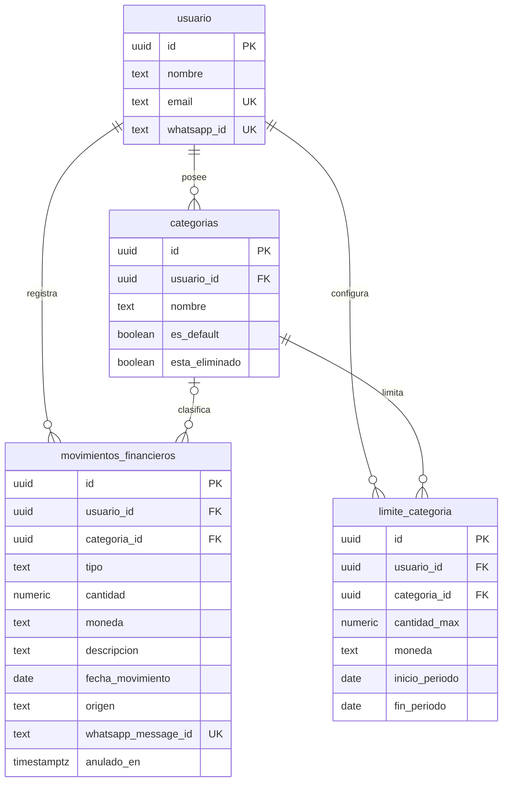

# Base de datos

Contrato de datos de Luka y relación entre el código, las migraciones y Supabase.

## Fuentes de verdad y alcance

El repositorio contiene fuentes con propósitos distintos:

| Fuente | Qué representa | Qué no demuestra |
| --- | --- | --- |
| `docs/decisions/0001-mvp-db-contract.md` | Decisión vigente sobre tablas oficiales y acceso mediado por backend. | Que el contrato ya esté aplicado en cada entorno. |
| `app/models/database.py` | Modelos SQLAlchemy que usa el backend actual. | El estado exacto de una base remota. |
| `supabase/migrations/` | Historial canónico de cambios de esquema para Supabase CLI. | Que una migración todavía no integrada haya llegado al entorno remoto. |
| Supabase remoto | Estado aplicado de producción o del entorno compartido. | No puede inferirse únicamente desde GitHub; requiere verificación operativa autorizada. |

`blob1618/luka` es propietario del contrato y de las migraciones. `blob1618/luka_frontend` consume el mismo esquema mediante su propio backend, pero no lo administra. `supabase/migrations/` es la única ubicación ejecutable por la integración de GitHub; Supabase remoto representa lo realmente aplicado.

## Contrato DB MVP vigente

Tablas oficiales de Release 1:

- `public.usuario` — usuarios oficiales del sistema.
- `public.categorias` — categorías para clasificar movimientos.
- `public.movimientos_financieros` — entidad central para ingresos y egresos.
- `public.limite_categoria` — presupuestos mensuales por categoría.
- `public.recordatorio` — recordatorios financieros del usuario.
- `public.evento` — auditoría y trazabilidad de acciones relevantes.
- `public.acuerdo_version` — versiones de acuerdos o consentimientos.
- `public.acuerdo_aceptado` — aceptación de acuerdos por usuario.
- `public.onboarding_invitacion` — invitaciones de vinculación por WhatsApp.
- `public.dashboard_login_link` — enlaces de acceso al dashboard.
- `public.conversation_flow`, `public.conversation_flow_version` — flujos conversacionales versionados.

`public.usuario.id` es el identificador interno y financiero. `public.usuario.whatsapp_id` identifica al remitente de WhatsApp y `public.usuario.auth_user_id` referencia la identidad en `auth.users`. Ambos identificadores externos son únicos cuando no son nulos. Los usuarios existentes permanecen con `auth_user_id = NULL`: no se vinculan ni fusionan automáticamente, y el email no se usa como criterio automático de vinculación.

`public.usuario.proactivo_habilitado` (default `true`) y `public.usuario.proactivo_ultimo_envio` (fecha local del último aviso) sostienen el recordatorio proactivo diario: el usuario puede desactivarlo por chat y el scheduler garantiza como máximo un aviso por día. Se incorporan mediante `20260918120000_add_usuario_proactive_reminders.sql` y deben aplicarse antes del código que las consulta.

`public.onboarding_invitacion` conserva el WhatsApp destinatario, estado, vencimiento, contadores y eventual usuario asociado. Solo puede haber una invitación `pendiente` por WhatsApp. La matriz de estado exige: `pendiente` y `vencida` sin usuario ni fechas terminales; `consumida` con usuario y `consumida_en`, pero sin `revocada_en`; y `revocada` solo con `revocada_en`. La FK al usuario usa `ON DELETE RESTRICT` para preservar la trazabilidad de invitaciones consumidas. El token original nunca se persiste: la tabla almacena únicamente `token_hash`, que es único y no vacío.

`public.dashboard_login_link` registra enlaces de acceso al dashboard: `token_hash` único y no vacío, estados `pendiente`/`consumido`/`vencido` con coherencia entre estado y `consumido_en`, y a lo sumo un enlace `pendiente` por usuario. La FK a `usuario` usa `ON DELETE CASCADE`.

`public.acuerdo_version` identifica versiones únicas y permite una sola versión vigente. `vigente_desde` es nullable y solo resulta obligatorio cuando `esta_vigente=true`, evitando fabricar fechas para versiones históricas inactivas. `public.acuerdo_aceptado` registra una aceptación por usuario y versión: las filas históricas se rotulan `legacy_desconocido` cuando su procedencia no puede demostrarse y las nuevas aceptaciones usan `web_onboarding` por defecto. No se insertaron versiones ni aceptaciones; todavía falta incorporar el contenido legal aprobado.

La FK PostgreSQL `public.usuario.auth_user_id -> auth.users(id)` existe únicamente en la migración. El metadata SQLAlchemy omite esa FK deliberadamente porque `auth.users` no existe en SQLite; la columna y su unicidad parcial sí se representan en ambos contratos.

Las tablas heredadas `public.movimientos` y `public.metas` no forman parte del contrato vigente, no tienen consumidores en el backend ni en el dashboard y se verificaron vacías en el entorno remoto. `20260919120000_drop_legacy_metas_movimientos.sql` las retira sin `CASCADE`, de modo que una dependencia no detectada haga fallar la migración en lugar de ser eliminada implícitamente.

`public.conversation_flow` conserva la identidad, el evento y el estado activo/retirado del flujo; `public.conversation_flow_version` conserva definiciones JSON versionadas con un único borrador y una única versión publicada por flujo. Son configuración global del backend, no datos financieros de un usuario. `20260916174000_add_conversation_flows.sql` habilita RLS sin agregar policies públicas: el panel nunca accede a estas tablas y opera mediante la API interna.

## Modelos actuales del backend

`app/models/database.py` define actualmente:

- `Usuario` -> `usuario`
- `OnboardingInvitacion` -> `onboarding_invitacion`
- `DashboardLoginLink` -> `dashboard_login_link`
- `AcuerdoVersion` -> `acuerdo_version`
- `AcuerdoAceptado` -> `acuerdo_aceptado`
- `Categoria` -> `categorias`
- `LimiteCategoria` -> `limite_categoria`
- `Recordatorio` -> `recordatorio`
- `Evento` -> `evento`
- `MovimientoFinanciero` -> `movimientos_financieros`
- `ConversationFlow` -> `conversation_flow`
- `ConversationFlowVersion` -> `conversation_flow_version`

Diagrama de las entidades financieras principales:


```mermaid
erDiagram
    usuario {
        uuid id PK
        text nombre
        text email UK
        text whatsapp_id UK
    }

    categorias {
        uuid id PK
        uuid usuario_id FK
        text nombre
        boolean es_default
        boolean esta_eliminado
    }

    movimientos_financieros {
        uuid id PK
        uuid usuario_id FK
        uuid categoria_id FK
        text tipo
        numeric cantidad
        text moneda
        text descripcion
        date fecha_movimiento
        text origen
        text whatsapp_message_id UK
        timestamptz anulado_en
    }

    limite_categoria {
        uuid id PK
        uuid usuario_id FK
        uuid categoria_id FK
        numeric cantidad_max
        text moneda
        date inicio_periodo
        date fin_periodo
    }

    usuario ||--o{ categorias : posee
    usuario ||--o{ movimientos_financieros : registra
    categorias o|--o{ movimientos_financieros : clasifica
    usuario ||--o{ limite_categoria : configura
    categorias ||--o{ limite_categoria : limita
```

Este diagrama representa el contrato del ORM, no una verificación del esquema remoto.

## Persistencia de movimientos

El flujo oficial es:

```text
WhatsApp -> Backend -> public.movimientos_financieros
```

`FinanceService.register_movement_from_whatsapp_text()` aplica estas reglas:

- Requiere `sender_phone` y busca una coincidencia en `public.usuario.whatsapp_id`.
- No crea ni vincula usuarios. Sin usuario vinculado devuelve `user_not_found` y no guarda el movimiento.
- Admite `tipo` `ingreso` o `egreso`, monto positivo, moneda y descripción.
- Usa `ARS` cuando el resultado del LLM no incluye moneda y normaliza el valor a mayúsculas.
- Busca una categoría activa perteneciente al usuario.
- No crea categorías automáticamente. Sin coincidencia guarda `categoria_id=null`.
- Guarda `origen="whatsapp_text"` y el identificador de Meta en `whatsapp_message_id`.
- Confirma al usuario solo después de un commit exitoso.

`public.movimientos_financieros` es la entidad central para ingresos y egresos. Los movimientos con `anulado_en` informado se excluyen de consultas y presupuestos; la fila y su `whatsapp_message_id` se conservan para impedir la recreación por reintentos de WhatsApp. La columna se incorpora mediante `20260917143651_annul_financial_movements.sql` y debe aplicarse antes del código que la consulta.

## Límites y presupuestos

`public.limite_categoria` define un presupuesto mensual por usuario, categoría, período y moneda. `cantidad_max` usa `numeric(18,2)`, debe ser `>= 0` y el período debe ser válido. La combinación `(usuario_id, categoria_id, inicio_periodo, moneda)` es única, por lo que un alta repetida actualiza el mismo presupuesto en vez de crear duplicados.

El mínimo en cero es deliberado: una compensación puede dejar a una categoría donante sin cupo. `20260920210000_allow_zero_limit_amount.sql` reemplaza el check `cantidad_max > 0` por `cantidad_max >= 0` y debe aplicarse antes del código que compensa.

Cuando el usuario propone una categoría inexistente al crear un límite, el backend solicita confirmación y luego crea o reactiva la categoría y persiste el límite en la misma transacción. La taxonomía base normaliza categorías conocidas, pero no funciona como una lista cerrada para los límites personalizados.

El gasto consumido, disponible, exceso y porcentaje no se persisten como columnas derivadas. `BudgetService` los calcula desde los egresos de `public.movimientos_financieros` que coinciden en usuario, categoría, moneda y fecha dentro del período. Los ingresos, movimientos sin categoría, otras monedas y otros períodos no consumen el presupuesto.

Después de registrar un egreso con un límite aplicable, la respuesta informa el valor del límite, el gasto acumulado, el disponible y el porcentaje consumido. `should_alert` queda reservado para distinguir un exceso; no controla si el estado calculado se muestra o no.

El esquema base contiene moneda, restricciones, unicidad e índices para límites y para la agregación de egresos. También habilita RLS en `limite_categoria` sin otorgar acceso a roles públicos.

El índice único parcial `categorias_usuario_nombre_activo_uidx` impide dos categorías activas con el mismo nombre normalizado dentro de un usuario.

## Deduplicación e índices

Todo mensaje de texto entrante se reclama atómicamente en Redis por su `message_id` antes de ejecutar onboarding, LLM o servicios de dominio. Un reintento concurrente se reconoce como `duplicate` y devuelve HTTP 200 sin volver a procesar ni responder. La marca `processing` vence para permitir recuperación ante una caída; al completar el envío se conserva una marca `completed` durante 48 horas.

Además, el backend consulta `whatsapp_message_id` antes de insertar un movimiento. Si ya existe, devuelve `duplicate` y evita una segunda fila. Esta restricción de base se conserva como defensa adicional para los movimientos, aunque el reclamo global de Redis ya protege saludos, límites, categorías, recordatorios y consultas.

Las migraciones y los modelos declaran un índice único parcial sobre `movimientos_financieros.whatsapp_message_id`, además de índices para búsqueda de usuario y consultas de movimientos.

Al crear la migración base se compararon el esquema remoto y una reconstrucción local: ambos presentaron 12 tablas públicas, 34 índices y 6 tablas con RLS. Toda migración posterior debe volver a verificar específicamente los objetos que modifica.

## Migraciones y desarrollo local

Supabase CLI es el flujo operativo vigente de migraciones durante STK-210. El historial previo quedó consolidado en `supabase/migrations/20260911010815_baseline_remote_schema.sql`, y el historial vigente llega hasta `20260921045538_recurring_confirmation_delivery.sql`.

1. Crear cada cambio con `supabase migration new <nombre>` y editar solo el archivo nuevo.
2. Ejecutar `supabase db reset` y `supabase db lint --level warning` antes de abrir o integrar el cambio.
3. Integrar a `main`; la integración de GitHub de Supabase (directorio de trabajo `.`) aplica automáticamente los timestamps que falten. CI reconstruye una base local en cada push y pull request; para usar ese control como barrera previa a producción, integrar mediante pull request con los checks requeridos.
4. Confirmar después del despliegue con `supabase migration list` y una verificación puntual de los objetos modificados. Que exista el archivo no prueba que la migración esté aplicada.
5. Corregir un cambio publicado mediante una nueva migración forward-only; no guardar rollbacks dentro de `supabase/migrations/`.
6. Limitar `Base.metadata.create_all()` a SQLite o bases locales descartables; no sustituye migraciones en Supabase.

### Preparación de Alembic y Gobernanza de Esquema (STK-210 / STK-211)

Como parte de **STK-210**, se establece la infraestructura de Alembic en el backend (`alembic.ini`, `alembic/env.py`, `alembic/versions/20260922_0001_initial_baseline.py`):
- **Autoridad única sin dualidad**: Durante STK-210, `supabase/migrations/` permanece como la única autoridad operativa del esquema. La transición definitiva y exclusiva hacia Alembic se ejecutará en **STK-211** (coordinada con el pipeline de despliegue automático `alembic upgrade head`).
- **Baseline canónica**: `20260922_0001_initial_baseline.py` modela el esquema completo para bases vacías y falla de inmediato ante esquemas preexistentes (fail-fast).
- **Adopción verificable (cero blind stamp)**: Se provee `scripts/adopt_existing_database.py` que comprueba el estado de `alembic_version`, verifica la ausencia de drift y estampa la revisión baseline nativamente. La ejecución sobre producción queda reservada para una autorización posterior explícita.
- **Auditoría de solo lectura y snapshots**: `scripts/audit_schema_adoption.py` contrasta la base viva o un snapshot JSON de catálogos (`--snapshot`) contra el Contrato de Comparación PostgreSQL sin leer PII ni ejecutar DDL (ver `docs/audits/README.md` y `docs/audits/export_supabase_catalog_snapshot.sql`).

Configuración local por defecto:

```text
sqlite:///./luka.db
```

Producción y entornos compartidos usan PostgreSQL mediante `DATABASE_URL`, normalmente en Supabase.

## Setup en Supabase

### Crear el proyecto

1. Ir a [supabase.com](https://supabase.com) y crear un proyecto.
2. Definir nombre, contraseña segura de base de datos y región cercana.
3. Esperar a que el proyecto termine de inicializarse.

### Obtener el connection string

1. Ir a **Settings → Database**.
2. Buscar la sección **Connection string**.
3. Elegir la pestaña **URI** (no Pool) y copiar el valor:

```text
postgresql://postgres:[PASSWORD]@[HOST]:[PORT]/postgres
```

### Configurar DATABASE_URL

Reemplazar `[PASSWORD]` con la contraseña creada y agregar al `.env`:

```bash
DATABASE_URL=postgresql://postgres:TU_CONTRASEÑA@TU_HOST:5432/postgres
```

### Preparar una base local

Para SQLite o una base local descartable, se pueden crear las tablas desde los modelos:

```bash
python -c "from app.models.database import engine, Base; Base.metadata.create_all(bind=engine)"
```

Este mecanismo no debe usarse para actualizar el esquema compartido en Supabase.

### Administrar el esquema compartido

El esquema compartido se administra únicamente con el flujo de migraciones descrito en la sección anterior: `supabase/migrations/` es la única fuente versionada y la integración de GitHub aplica los cambios en `main`.

### Verificar la conexión

```bash
python -c "from app.models.database import SessionLocal; db = SessionLocal(); print('Conectado a Supabase')"
```

### Notas de seguridad y operación

- Mantener la contraseña en secreto y no subirla al repositorio; `.env` está en `.gitignore`.
- Usar el SQL Editor solo para operaciones administradas por el equipo; no introducir cambios de esquema sin versionarlos antes en `supabase/migrations/`.
- RLS está habilitado en las tablas protegidas y no hay policies públicas para `anon`/`authenticated`; el backend usa un rol con `BYPASSRLS`.
- El tier gratuito de Supabase ofrece 500MB de almacenamiento, suficiente para desarrollo.
- El connection pooling con PgBouncer de Supabase está disponible en Settings si se alcanzan los límites de conexiones.

### Solución de problemas

**"Connection refused"** → verificar que `DATABASE_URL` sea correcto, pegándolo exactamente desde Supabase.

**"too many connections"** → el tier gratuito tiene límite de conexiones. Habilitar PgBouncer en Settings de Supabase.

**"relation does not exist"** → en local, revisar la inicialización local. En Supabase compartido, verificar que la migración versionada correspondiente haya sido aplicada; no intentar reparar el entorno remoto con `Base.metadata.create_all()`.

**El webhook no encuentra al usuario** → confirmar que el número recibido coincida con `public.usuario.whatsapp_id`; el registro por texto no crea ni vincula usuarios automáticamente.

**El movimiento queda sin categoría** → verificar que exista una categoría activa para ese usuario con el nombre interpretado. Si no existe, el comportamiento esperado es guardar `categoria_id=null`.

## Acceso a datos financieros y RLS

Para Release 1, el acceso financiero es mediado por backend:

- WhatsApp -> Backend -> Supabase/PostgreSQL.
- Dashboard -> Backend -> Supabase/PostgreSQL.

No se permite que un dashboard consulte directamente los movimientos financieros de Supabase en esta etapa. El backend debe aplicar autorización y filtrar siempre por el usuario correspondiente.

La migración base declara `ENABLE ROW LEVEL SECURITY` para las tablas protegidas que ya lo tenían. `20260911011601_protect_movimientos_financieros.sql` corrige las diferencias detectadas en la tabla financiera central: habilita RLS y agrega los índices de deduplicación y consulta que faltaban. No se agregan policies públicas; el backend usa un rol con `BYPASSRLS`. El estado efectivo debe volver a verificarse cuando una migración toque permisos o RLS.
