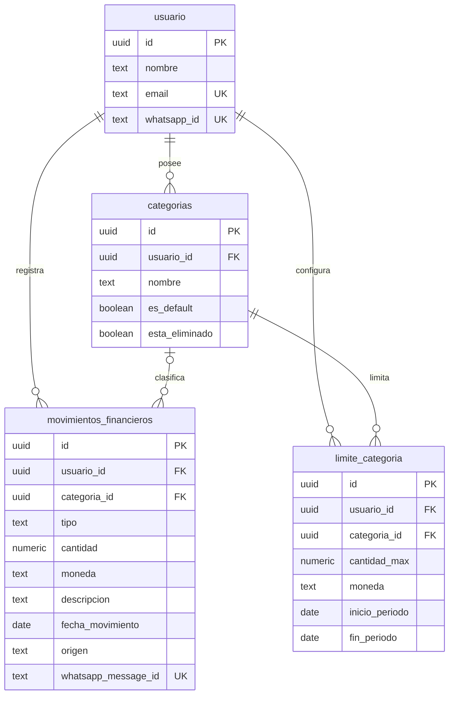

# Base de datos

Estado del contrato de datos de LUKA después de implementar HU-PRE-01/STK-47 y relación entre el código, las migraciones y Supabase.

## Fuentes de verdad y alcance

El repositorio contiene fuentes con propósitos distintos:

| Fuente | Qué representa | Qué no demuestra |
| --- | --- | --- |
| `docs/decisions/0001-mvp-db-contract.md` | Decisión vigente sobre tablas oficiales y acceso mediado por backend. | Que el contrato ya esté aplicado en cada entorno. |
| `app/models/database.py` | Modelos SQLAlchemy que usa el backend actual. | El estado exacto de una base remota. |
| `supabase/migrations/` | Historial canónico de cambios de esquema para Supabase CLI. | Que una migración todavía no integrada haya llegado al entorno remoto. |
| `database/reference/schema_supabase_inicial_legacy.sql` | Snapshot histórico inicial, conservado solo como referencia. | El estado actual o un script apto para reconstruir o reparar la base. |
| Supabase remoto | Estado aplicado de producción o del entorno compartido. | No puede inferirse únicamente desde GitHub; requiere verificación operativa autorizada. |

`blob1618/luka` es propietario del contrato y de las migraciones. `blob1618/luka_frontend` consume el mismo esquema mediante su propio backend, pero no lo administra. `supabase/migrations/` es la única ubicación ejecutable por la integración de GitHub; Supabase remoto representa lo realmente aplicado.

`database/reference/schema_supabase_inicial_legacy.sql` es histórico y no ejecutable. No debe usarse para reconstruir ni reparar la base. Después de aplicar y verificar una migración en Supabase se deberá generar un snapshot nuevo mediante un procedimiento controlado; STK-143 no genera todavía ese snapshot.

## Contrato DB MVP vigente

Tablas oficiales de Release 1:

- `public.usuario`
- `public.categorias`
- `public.movimientos_financieros`
- `public.limite_categoria`
- `public.recordatorio`
- `public.evento`
- `public.acuerdo_version`
- `public.acuerdo_aceptado`
- `public.onboarding_invitacion`

`public.usuario.id` continúa siendo el identificador interno y financiero. `public.usuario.whatsapp_id` identifica al remitente de WhatsApp y `public.usuario.auth_user_id` referencia la identidad en `auth.users`. Ambos identificadores externos son únicos cuando no son nulos. Los usuarios existentes permanecen con `auth_user_id = NULL`: no se vinculan ni fusionan automáticamente, y el email no se usa como criterio automático de vinculación.

`public.onboarding_invitacion` conserva el WhatsApp destinatario, estado, vencimiento, contadores y eventual usuario asociado. Solo puede haber una invitación `pendiente` por WhatsApp. La matriz de estado exige: `pendiente` y `vencida` sin usuario ni fechas terminales; `consumida` con usuario y `consumida_en`, pero sin `revocada_en`; y `revocada` solo con `revocada_en`. La FK al usuario usa `ON DELETE RESTRICT` para preservar la trazabilidad de invitaciones consumidas. El token original nunca se persiste: la tabla almacena únicamente `token_hash`, que es único y no vacío.

`public.acuerdo_version` identifica versiones únicas y permite una sola versión vigente. `vigente_desde` es nullable y solo resulta obligatorio cuando `esta_vigente=true`, evitando fabricar fechas para versiones históricas inactivas. `public.acuerdo_aceptado` registra una aceptación por usuario y versión: las filas históricas se rotulan `legacy_desconocido` cuando su procedencia no puede demostrarse y las nuevas aceptaciones usan `web_onboarding` por defecto. No se insertaron versiones ni aceptaciones; todavía falta incorporar el contenido legal aprobado.

La FK PostgreSQL `public.usuario.auth_user_id -> auth.users(id)` existe únicamente en la migración. El metadata SQLAlchemy omite esa FK deliberadamente porque `auth.users` no existe en SQLite; la columna y su unicidad parcial sí se representan en ambos contratos.

`public.movimientos_financieros` es la entidad central para ingresos y egresos.

## Presupuestos por categoría (HU-PRE-01 / STK-47)

`public.limite_categoria` define un presupuesto mensual por usuario, categoría, período y moneda. `cantidad_max` usa `numeric(18,2)`, debe ser positiva y el período debe ser válido. La combinación `(usuario_id, categoria_id, inicio_periodo, moneda)` es única, por lo que un alta repetida actualiza el mismo presupuesto en vez de crear duplicados.

Cuando el usuario propone una categoría inexistente al crear un límite, el backend solicita confirmación y luego crea o reactiva la categoría y persiste el límite en la misma transacción. La taxonomía base normaliza categorías conocidas, pero no funciona como una lista cerrada para los límites personalizados.

El gasto consumido, disponible, exceso y porcentaje no se persisten como columnas derivadas. `BudgetService` los calcula desde los egresos de `public.movimientos_financieros` que coinciden en usuario, categoría, moneda y fecha dentro del período. Los ingresos, movimientos sin categoría, otras monedas y otros períodos no consumen el presupuesto.

Después de registrar un egreso con un límite aplicable, la respuesta informa el valor del límite, el gasto acumulado, el disponible y el porcentaje consumido. `should_alert` queda reservado para distinguir un exceso; no controla si el estado calculado se muestra o no.

El esquema base contiene moneda, restricciones, unicidad e índices para límites y para la agregación de egresos. También habilita RLS en `limite_categoria` sin otorgar acceso a roles públicos.

El índice único parcial `categorias_usuario_nombre_activo_uidx` impide dos categorías activas con el mismo nombre normalizado dentro de un usuario.


## Modelos actuales del backend

`app/models/database.py` define actualmente:

- `Usuario` -> `usuario`
- `OnboardingInvitacion` -> `onboarding_invitacion`
- `AcuerdoVersion` -> `acuerdo_version`
- `AcuerdoAceptado` -> `acuerdo_aceptado`
- `Categoria` -> `categorias`
- `LimiteCategoria` -> `limite_categoria`
- `Recordatorio` -> `recordatorio`
- `Evento` -> `evento`
- `MovimientoFinanciero` -> `movimientos_financieros`

Diagrama de las entidades financieras principales:


```mermaid
erDiagram
    usuario {
        uuid id PK
        text nombre
        text email UK
        text whatsapp_id UK
    }

    categorias {
        uuid id PK
        uuid usuario_id FK
        text nombre
        boolean es_default
        boolean esta_eliminado
    }

    movimientos_financieros {
        uuid id PK
        uuid usuario_id FK
        uuid categoria_id FK
        text tipo
        numeric cantidad
        text moneda
        text descripcion
        date fecha_movimiento
        text origen
        text whatsapp_message_id UK
    }

    limite_categoria {
        uuid id PK
        uuid usuario_id FK
        uuid categoria_id FK
        numeric cantidad_max
        text moneda
        date inicio_periodo
        date fin_periodo
    }

    usuario ||--o{ categorias : posee
    usuario ||--o{ movimientos_financieros : registra
    categorias o|--o{ movimientos_financieros : clasifica
    usuario ||--o{ limite_categoria : configura
    categorias ||--o{ limite_categoria : limita
```

Este diagrama representa el contrato del ORM, no una verificación del esquema remoto.

## Persistencia de movimientos de STK-35

El flujo oficial es:

```text
WhatsApp -> Backend -> public.movimientos_financieros
```

`FinanceService.register_movement_from_whatsapp_text()` aplica estas reglas:

- Requiere `sender_phone` y busca una coincidencia en `public.usuario.whatsapp_id`.
- No crea usuarios. Sin usuario vinculado devuelve `user_not_found` y no guarda el movimiento.
- Admite `tipo` `ingreso` o `egreso`, monto positivo, moneda y descripción.
- Usa `ARS` cuando el resultado del LLM no incluye moneda y normaliza el valor a mayúsculas.
- Busca una categoría activa perteneciente al usuario.
- No crea categorías automáticamente. Sin coincidencia guarda `categoria_id=null`.
- Guarda `origen="whatsapp_text"` y el identificador de Meta en `whatsapp_message_id`.
- Confirma al usuario solo después de un commit exitoso.

El alta, register, login y vinculación inicial de usuarios no forman parte de STK-35. Las categorías default o personalizadas también requieren trabajo separado.

## Deduplicación e índices

Todo mensaje de texto entrante se reclama atómicamente en Redis por su `message_id` antes de ejecutar onboarding, LLM o servicios de dominio. Un reintento concurrente se reconoce como `duplicate` y devuelve HTTP 200 sin volver a procesar ni responder. La marca `processing` vence para permitir recuperación ante una caída; al completar el envío se conserva una marca `completed` durante 48 horas.

Además, el backend consulta `whatsapp_message_id` antes de insertar un movimiento. Si ya existe, devuelve `duplicate` y evita una segunda fila. Esta restricción de base se conserva como defensa adicional para los movimientos, aunque el reclamo global de Redis ya protege saludos, límites, categorías, recordatorios y consultas.

La migración base y el ORM declaran un índice único parcial sobre `movimientos_financieros.whatsapp_message_id`, además de índices para búsqueda de usuario y consultas de movimientos.

Al crear la migración base se compararon el esquema remoto y una reconstrucción local: ambos presentaron 12 tablas públicas, 34 índices y 6 tablas con RLS. Toda migración posterior debe volver a verificar específicamente los objetos que modifica.

## Migraciones y desarrollo local

Supabase CLI es el flujo único de migraciones. El historial previo quedó consolidado en `supabase/migrations/20260911010815_baseline_remote_schema.sql`, cuyo timestamp coincide con el historial remoto.

1. Crear cada cambio con `supabase migration new <nombre>` y editar solo el archivo nuevo.
2. Ejecutar `supabase db reset` y `supabase db lint --level warning` antes de abrir o integrar el cambio.
3. Integrar a `main`; la integración de GitHub de Supabase aplica automáticamente los timestamps que falten.
4. Confirmar después del despliegue con `supabase migration list` y una verificación puntual de los objetos modificados.
5. Corregir un cambio publicado mediante una nueva migración forward-only; no guardar rollbacks dentro de `supabase/migrations/`.
6. Limitar `Base.metadata.create_all()` a SQLite o bases locales descartables; no sustituye migraciones en Supabase.

Configuración local por defecto:

```text
sqlite:///./luka.db
```

Producción y entornos compartidos usan PostgreSQL mediante `DATABASE_URL`, normalmente en Supabase.

## Acceso a datos financieros y RLS

Para Release 1, el acceso financiero es mediado por backend:

- WhatsApp -> Backend -> Supabase/PostgreSQL.
- Dashboard -> Backend -> Supabase/PostgreSQL.

No se permite que un dashboard consulte directamente los movimientos financieros de Supabase en esta etapa. El backend debe aplicar autorización y filtrar siempre por el usuario correspondiente.

La migración base declara `ENABLE ROW LEVEL SECURITY` para las tablas protegidas que ya lo tenían. `20260911011601_protect_movimientos_financieros.sql` corrige las diferencias detectadas en la tabla financiera central: habilita RLS y agrega los índices de deduplicación y consulta que faltaban. No se agregan policies públicas; el backend usa un rol con `BYPASSRLS`. El estado efectivo debe volver a verificarse cuando una migración toque permisos o RLS.

El micrositio/dashboard y su acceso seguro mediante Magic Link están relacionados con STK-54. Requieren coordinación entre backend y frontend y no fueron implementados por STK-35.

## Funcionalidad fuera de STK-35

- Consulta de movimientos de STK-128.
- Alta y vinculación oficial de usuarios por WhatsApp.
- Login y Magic Link.
- Generación, hashing, envío, consumo y revocación funcional de invitaciones.
- Contenido legal aprobado y flujo de aceptación.
- Administración completa de categorías default fuera del flujo de límites.
- Validación de consentimiento y escritura de eventos dentro del flujo de movimientos.
- Endpoints financieros del dashboard.

Estas capacidades pueden formar parte de la arquitectura objetivo, pero no deben documentarse como comportamiento actual de STK-35.

## Pendientes operativos y de seguridad/costos

- Agregar observabilidad de latencia para webhook, LLM, base y respuesta. Durante pruebas manuales se observó una latencia aproximada de 5–10 segundos en el flujo completo, pendiente de medición formal por etapa.
- Investigar typing indicator y mark as read en WhatsApp Business API.
- Incorporar rate limiting y protecciones frente a abuso de tokens.
- Evitar llamar al LLM para usuarios no registrados o mensajes ya procesados.
- Evaluar un pre-router para saludos y solicitudes claramente fuera de alcance.
